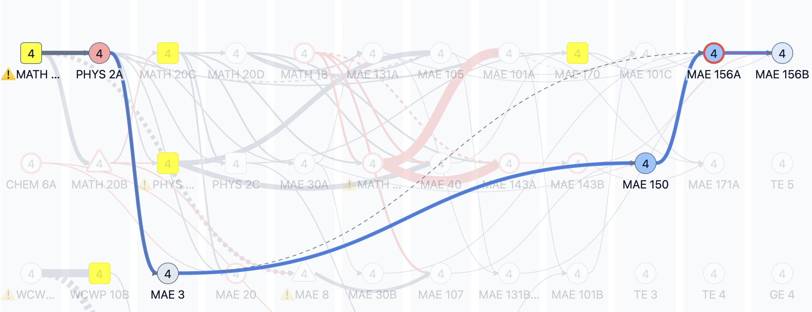

# Slack Optimizer

## What does this tool do?
This tool rearranges courses in a curriculum to improve overall course slack.

## What is course slack?
We define slack as the number of terms between a course and its prerequisite. The total slack in a curriculum is the sum of the slack for each of its courses. 

## Why do we care about slack?
Presumably courses have prerequisites because they build on the knowledge of a previous course. To do that successfully the knowledge should be practiced or somewhat fresh. When there are large gaps between two courses that build on each other, it is perfectly reasonable to expect students to struggle. See this example below:

There are 6 terms between MAE 3 and MAE 150. That's two whole years - how much can you expect students to remember from MAE 3 by the time they take MAE 150?

## How do you optimize?
Basically the tool grabs all the elective courses and freezes them. It them tries to rearrange everything else according to a set of cost functions and conditions that are explained [in more depth elsewhere](./README_technical.md). The conditions the tool currently tries to adhere to are:

- 12 quarters
- No more than 18 units per quarter
- No less than 12 units per quarter

## How do I read the results?
The results are, for those with access, available [here](https://tableau.ucsd.edu/#/views/Slack_Calcs/Avgslack?:iid=1) 

The visualization is broken up into three sections - compression, max slack and links. Compression, or average slack, tracks how much more compressed the courses can be, percentage-wise. That is, a 30% score means we can reduce the total slack of the curriculum by 30%. Max slack tracks the same but for the highest slack link in a curriculum. Can we improve on that? The links section contains links so you can see the unoptimized and otpimized plans side by side. 

## Are these plans objectively better?
No, not necessarily. They are simply provided to show that there are alternative ways of arranging courses in a curriculum. It may turn out that there is a good reason that there is a gap between course X and course Y, but this tool exposes that reason should it exist. It can help in thoughtful and purposeful program review.

## What about electives?
We're currently working on a separate project to help understand how elective choices can impact curriculum complexity. Once it is finished we will also run the optimizations on those curricula. 